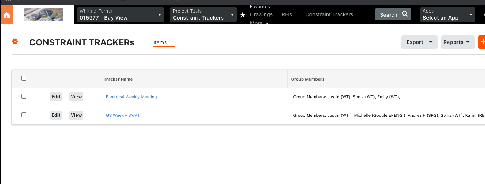
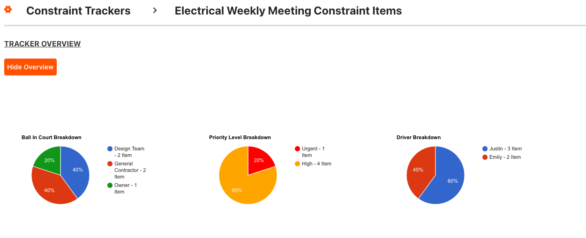
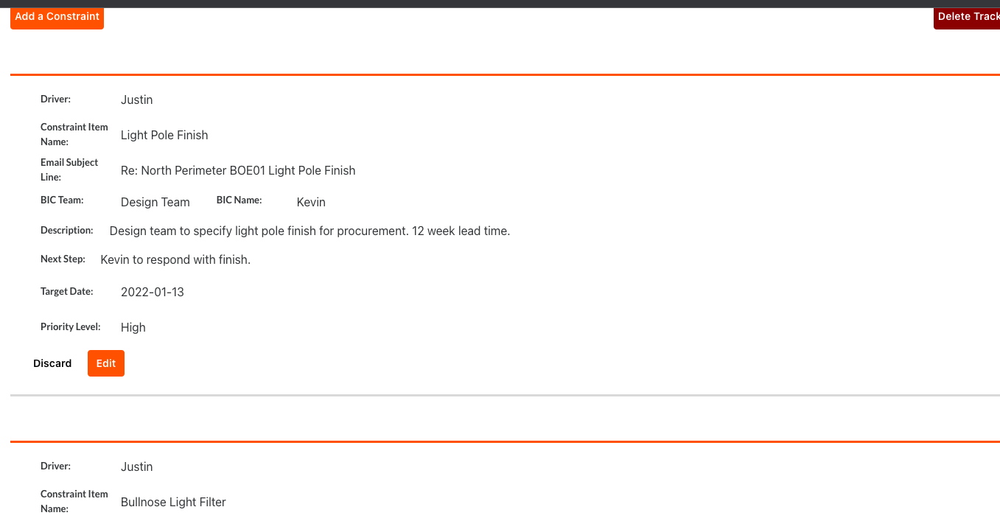

# Procore - Constraint Log Feature

[Procore Constraint Log via Heroku](https://procore-constraint-log.herokuapp.com/)

[Procore Constraint Log Github Repository (Frontend)](https://github.com/justinluu8235/procore-constraint-log)

[Procore Constraint Log Github Repository (Backend)](https://github.com/justinluu8235/procore-constraint-log-backend)

<a href="procore.com">Procore</a> is an existing construction software company. The software has many options for tracking issues - RFIs, observations, punch lists, etc. A big portion of the construction project management workflow is on the platform.

This constraint log is a feature built out using procore's concept and aesthetics. Many general contractors find themselves recreating trackers in dozens of internal excel and google sheets that are meant for tracking construction constraints between small or internal groups (ex: electrical team issues meeting, building 1 kitchen eeekly constraint meeting etc). 

The feature is for teams to stay focused and communicate clearly on BICs, target dates, next steps, and priority levels and overall issue stat summaries. 


## Example usages
- List of meeting constraint trackers:
    - 
- Stats for constraint issue summaries:
    - 
- Adding constraint items to their trackers:
    - 


## Component toggling to hide/show tracker stats

```js 
<input type="button" class="toggle-summary-button" name="button" value="Hide Overview" onClick={this.handleOverviewClick}/>
                <div class="constraint-summary">
                    <ConstraintSummary stats={this.state.stats} />
                </div>
```
```js
   handleOverviewClick = () => {
        let summaryDiv = document.querySelector('.constraint-summary');
        summaryDiv.classList.toggle("hidden");

        let toggleButton = document.querySelector('.toggle-summary-button');
        if(toggleButton.value == "Hide Overview"){
            toggleButton.value = "Show Overview";
        }
        else{
            toggleButton.value = "Hide Overview"
        }
        
    }
```

## Model associations 

Code snippet of mongoose model associations:

```js 
//define schema
const constraintItemSchema = new mongoose.Schema({
    driver:String,
    itemName: String, 
    emailSubject: String,
    bICTeam: String, 
    bICName: String,
    description: String, 
    nextStep: String, 
    targetDate: String,
    priorityLevel: String,
    trackerId: {
        type: mongoose.Schema.Types.ObjectId,
        ref: 'ConstraintTracker'
    },
})
```


# Future development: 
- add user auth - trackers only visible to group members included. 